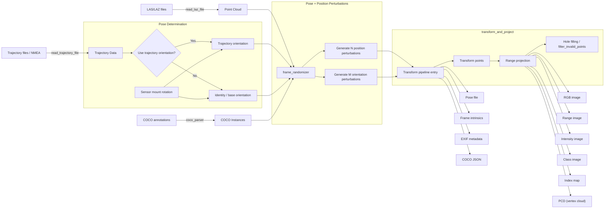

# 📦 RangeGen — README

A Python toolkit for generating **LiDAR range images**, **RGB projections**, **intensity maps**, **classification maps**, and **pose‑aware point cloud outputs** using **LAS/LAZ** point clouds and (optionally) **trajectory files**.

This toolkit supports:

- Sensor‑frame range image generation
- Randomized pose augmentation
- Frame generation along a trajectory
- Object detection‑driven frame generation (COCO workflow)
- Direct sampling‑based frame generation (no trajectory required)
- Saving EXIF metadata (GPS + timestamp) is available in the image-export helper
- COCO annotation generation and label expansion

The package is structured for research, dataset creation, and ML pipeline input generation.

---

## 📁 Project Structure

```
src/rangegen/
│
├── __init__.py                    # Package initialization, public exports
├── main.py                        # Main entry point for the CLI pipeline
│
├── range_image_generator/
│   ├── __init__.py               # Public API exports + core types
│   ├── io_utils/                 # LAS/LAZ reading, trajectory parsing, image export
│   │   ├── pointcloud.py
│   │   ├── trajectory.py
│   │   ├── image_export.py
│   │   └── classification.py
│   ├── projection.py             # Spherical range projection + hole-filling
│   ├── transforms.py             # Coordinate transforms, pose perturbations
│   ├── frame_generator.py        # High-level transform + project pipeline
│   ├── coco_writer.py            # COCO annotation generation + JSON export
│   ├── utils.py                  # FrameIntrinsics / Pose / Frame_Task, dir helpers
│   ├── read_exif.py              # EXIF reading utilities
│   └── pyprojCoordinateTranformer.py  # WGS84 <-> ETRS-TM35FIN / UTM, NMEA GGA parsing
├──Samplers
    ├── generate_from_trajectory.py              # Trajectory-based frame generation
    ├── generate_from_random_points.py           # Random sampling-based frame generation
    ├── generate_from_trajectory_with_pole_detection.py  # Pole-based generation
    ├── generate_around_objects.py               # Object detection-driven generation (COCO)
└── reprojection/                            # Deprojection + COCO label expansion
    ├── deprojection.py
    ├── coco_parser.py
    ├── filenamematcher.py
    ├── label_expansion.py
    └── multiprocessing_workers.py
```

Configuration examples are available in `confs/` directory.

---

## 🚀 Quick Start

### **1. Prerequisites**

- Python 3.12+
- Dependencies: `numpy`, `scipy`, `pillow`, `opencv-python-headless`, `laspy`, `pypcd4`, `pycocotools`, `pyproj`, `scikit-learn`, `tqdm`, `matplotlib`
- Optional (internal): `poledetection` — an internal package installed locally; required only for the pole-detection pipeline.

### **2. Installation**

```bash
pip install numpy scipy pillow opencv-python-headless laspy pypcd4 pycocotools pyproj scikit-learn tqdm matplotlib

# Pole-detection pipeline only (internal package, install locally):
# pip install poledetection
```

To install as editable package:

```bash
pip install -e .
```

### **3. Run Example**

```bash
uv run src/rangegen/main.py confs/config.toml 

or

rangegen confs/reprojection_testing.toml
```

See [`confs/`](confs/) for more configuration examples.

---

## 🛠 Installation & Setup

```bash
# Install dependencies
pip install numpy scipy pillow opencv-python-headless laspy pypcd4 pycocotools pyproj scikit-learn tqdm matplotlib

# Pole-detection pipeline only (internal package, install locally):
# pip install poledetection

# Optional: install as editable
pip install -e .

# Verify installation
python -c "from rangegen import load_pointcloud; print('OK')"
```

---

## 🚀 Features

### **✓ LAZ/LAS Parsing**
- Fast memory‑mapped loading
- RGB, classification, intensity,
- EXIF metadata extraction (GPS, timestamp)

### **✓ Spherical Range Projection**
- KITTI/Rangenet++‑style projection
- Returns range, vertex map, intensity map, class map, index map, and RGB

### **✓ Frame Generation Pipelines**
- **Random sampling** - Generate frames at random positions
- **Trajectory-based** - Generate per pose along a trajectory
- **Pole-based** - Generate around detected poles
- **Object detection** - Generate around COCO-detected objects

### **✓ Pose Transformations**
- Position + orientation perturbation (with configurable noise)
- Euler‑based noise injection
- Transform point clouds into LiDAR frame

### **✓ EXIF-enabled Image Saving**
- Location tagged based on sensor ETRS‑TM35FIN → WGS84 conversion
- Optional timestamp embedding
- GPS altitude and coordinate storage

### **✓ COCO Annotation Support**
- Full COCO detection workflow
- Label expansion for hierarchical class structures
- Automatic JSON annotation generation

### **✓ Reprojection Testing**
- Deprojection utilities for validation
- Multiprocessing support for large datasets

### **✓ Performance**
- Memory‑mapped point clouds (efficient for 100M+ points)
- Multi-threaded and multiprocessing support

---

## 🧩 Core API Overview

### **Load point clouds & trajectories**

```python
from rangegen import (
    load_pointcloud,
    read_trajectory_file,
)

# Load a LAS/LAZ point cloud (memory-mapped) and keep its metadata
point_cloud = load_pointcloud("data/example.laz", fields=["intensity", "classification"])
memmap_meta = point_cloud.metadata  # MemmapMetadata describing the on-disk array

# Read a trajectory (CSV, NMEA, or YAML)
trajectory = read_trajectory_file("data/trajectory.csv")
```

### **Match LAS files to trajectory files**

```python
from rangegen import match_las_and_trajectory

pairs = match_las_and_trajectory("laz_folder", "trajectory_folder")
```

### **Generate frames with pose perturbation**

```python
from rangegen import (
    FrameIntrinsics,
    Pose,
    load_pointcloud,
    frame_randomizer,
    batched_frame_randomizer,
)
from scipy.spatial.transform import Rotation as R
import numpy as np

# Example values
pos = np.array([0.0, 0.0, 0.0])
rot = R.identity().as_quat()
frame_intrinsics = FrameIntrinsics(
    fov_down=-25.0,
    fov_up=3.0,
    height=64,
    width=1024,
    max_range=100.0,
)
point_cloud = load_pointcloud("data/example.laz", fields=["intensity", "classification"])

# Create a task
task = Frame_Task(
    basename="frame_0001",
    pose=Pose(position=pos, orientation=rot),
    frame_intrinsics=frame_intrinsics,
    points=point_cloud.metadata,
    output_dir="output",
    position_perturbation=((0, 1), (0, 1), (0, 1)),  # x, y, z (min, max) ranges
    orientation_perturbation=((0, 0), (0, 0), (0, 0)),  # roll, pitch, yaw
    number_of_pos_perturbations=3,
    number_of_orientation_perturbations=5,
)

# Generate the frame (returns images, annotations, output_dir)
images, annotations, output_dir = frame_randomizer(task)
```

### **Batch processing**

```python
from rangegen import batched_frame_randomizer

# A single task can carry a list of nearby poses that share one crop
# (``pose`` and ``basename`` are lists inside that one task).
images, annotations = batched_frame_randomizer(task)
```

### **Reprojection testing**

```python
from rangegen.reprojection.deprojection import label_pointcloud_coco

# Label the point cloud from existing COCO annotations
detection_results, categories = label_pointcloud_coco(
    points, coco_file="annotations/coco.json", cfg=config
)
```

---

## ⚙️ Configuration File Example (`config.toml`)

```toml
[paths]
laz_dir = "data/laz/"
trajectory_dir = "data/trajectory/"
output_dir = "output_dataset"
coco_file = "annotations/coco.json"

[image]
width = 1024
height = 64
max_range = 100
elevation_range = [-25, 3]

[sensor]
sensor_orientation = [0, 0, 0]
use_trajectory_orientation = true

[processing]
pipeline = "random"  # Options: random, trajectory, poles, coco, detected
randomize = true
pos_perturbations = 0
orientation_perturbations = 0
rand_range_x = [-2, 2]
rand_range_y = [-2, 2]
rand_range_z = [-1, 1]
rand_range_roll = [-1, 1]
rand_range_pitch = [-1, 1]
rand_range_yaw = [-1, 1]
skip_start = 0
skip_end = 0
stride_distance = 30
fields = ["intensity", "classification"]
number_of_processes = 1
batched = false
```

### **Configuration Options**

| Option | Default | Description |
|--------|---------|---------|
| `pipeline` | `"random"` | Generation pipeline: `random`, `trajectory`, `poles`, `coco`, `detected` |
| `randomize` | `true` | Enable pose randomization |
| `pos_perturbations` | `0` | Number of position perturbation variants |
| `orientation_perturbations` | `0` | Number of orientation perturbation variants |
| `skip_start` | `0` | Skip first N trajectory points |
| `skip_end` | `0` | Skip last N trajectory points |
| `stride_distance` | `30` | Distance between consecutive frames (meters) |
| `use_trajectory_orientation` | `true` | Use trajectory rotation |
| `fields` | `["intensity", "classification"]` | LAS fields to extract |
| `number_of_processes` | `1` | Number of parallel processes |
| `batched` | `false` | Enable batch processing |
| `batch_size` | `0` | Batch size when batched is enabled |

See [`confs/`](confs/) for real-world configuration examples.

---

## 📊 Output Structure

Depending on script options and pipeline, you may see:

```
output/
  {las_file_basename}/
    random/                          # Random sampling output
      *.png                          # Range, RGB, intensity, classification images
      pose.txt                       # Pose information per frame
      frame_intrinsic/               # Intrinsic parameters per frame
      coco.json                      # COCO annotations (if applicable)
    trajectory/                      # Trajectory-based output
      ...
    poles/                           # Pole-based output
      ...
    detected/                        # Object detection-based output
      ...
```

Each image is saved as PNG. GPS and timestamp EXIF embedding is implemented in
the image-export helper (``save_image``), but the final EXIF write is currently
disabled, so exported PNGs do not carry EXIF metadata yet.

---

## 📁 Configuration Examples

The [`confs/`](confs/) directory contains:
- `config.toml` - Basic configuration

Copy a config file and modify paths for your use case.

---

## 🧪 Quick Test

Generate a small sampling-based set:

```bash
rangegen confs/randomSampling.toml
```

Then inspect images under `output_dir`.


## 🔧 Advanced Usage

### **Coordinate Transformation**

```python
from rangegen.range_image_generator.pyprojCoordinateTranformer import (
    ETRSTM35FINxy_to_WGS84lalo,
)

# Convert ETRS-TM35FIN easting/northing to WGS84 lat/lon
lat, lon = ETRSTM35FINxy_to_WGS84lalo(easting, northing)
```

### **NMEA Parsing**

```python
from rangegen.range_image_generator.io_utils import parse_nmea_file

poses = parse_nmea_file("trajectory.nmea")
```

### **Custom Frame Generation**

```python
from rangegen import (
    transform_points,
    perturb_position,
    perturb_orientation,
)

# Transform points into the sensor frame
sensor_points = transform_points(world_points, position, orientation)

# Perturb a pose (each axis takes a (min, max) range)
position_perturbed = perturb_position(pos, range_x, range_y, range_z)
orientation_perturbed = perturb_orientation(rot, range_x, range_y, range_z)
```

---

## 📜 License

MIT License. See LICENSE file for details.

---

## 🙋 Support & Issues

Need help or found a bug? Please open an issue on the project's issue tracker.

---

## 🤝 Contributing

Contributions are welcome!

---

## 📈 Version History

| Version | Date    | Changes |
|---------|---------|---------|
| 0.1.0   | current | Initial release: range images, frame-generation pipelines, COCO + reprojection |

---

## 🔄 System Architecture


